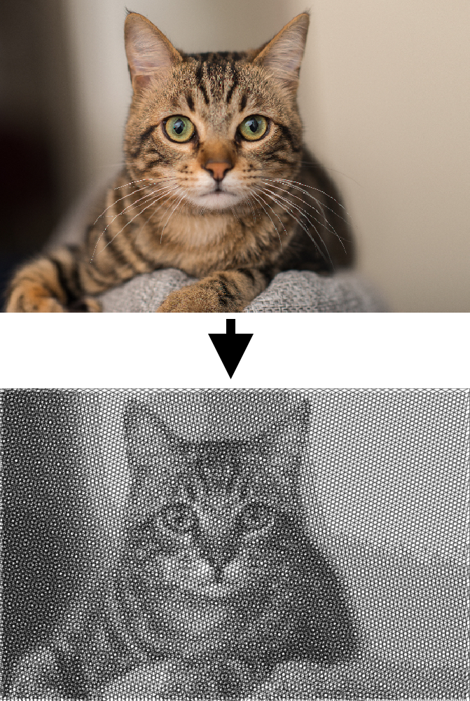

# Crosshatching

Crosshatching in TypeScript.

## Try it now

Go to [https://deshrike.github.io/crosshatcher/](https://deshrike.github.io/crosshatcher/)

## Examples




## Running locally

### Installation

```console
git clone https://github.com/DeShrike/crosshatcher.git
cd crosshatcher
npm install

```

### Development

Simple build:

```console
npm run build
```

Run Typescript in watch mode:

```console
npm run watch
```

Changes made to Typescript files will be transpiled to Javascript.

### Server

Run a local webserver:

```console
npm run server
```

Open http://127.0.0.1:8000 in your browser.

## Credits

Based on Python project 'crosshatcher' by Stephen M. Cameron

